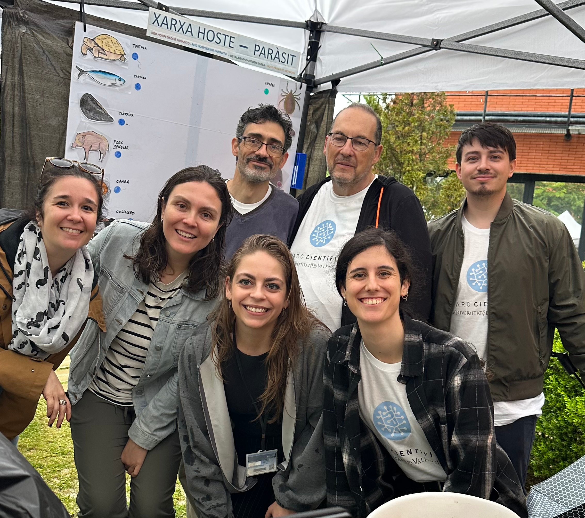

Somos el laboratorio de Biolgía Computacional del grupo E3 (ecología, evolución y etología), del Instituto Cavanilles de Biodiversidad y Biología Evolutiva (ICBiBE), de la Universidad de Valencia.
Encontraréis más información en la [web del ICBiBE](https://www.uv.es/uvweb/institut-universitari-cavanilles-biodiversitat-biologia/ca/institut-cavanilles-biodiversitat-biologia-evolutiva-1285893448913.html)

El código fuente de esta página está alojado en GitHub:
[rights4parasites](https://github.com/rights4parasites/rights4parasites.github.io)

Podéis contactar con nosotros a través de los correos:
rights4parasites@cuc.anonaddy.com
joiglu@valencia.edu

